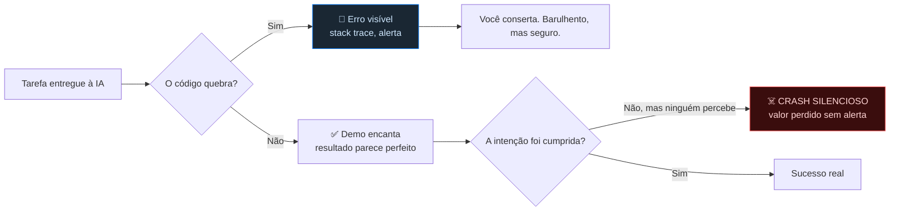
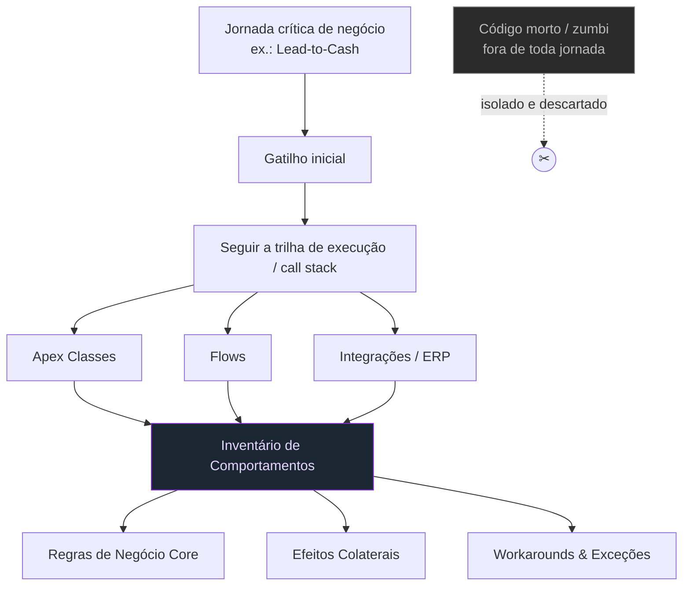
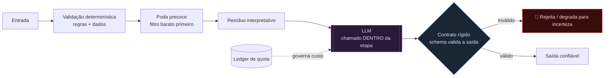
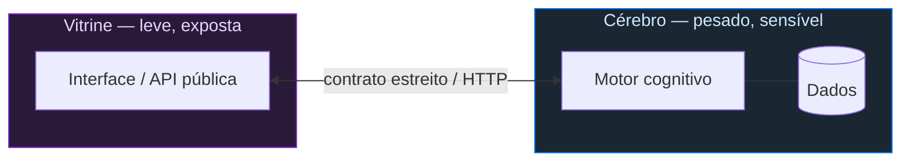
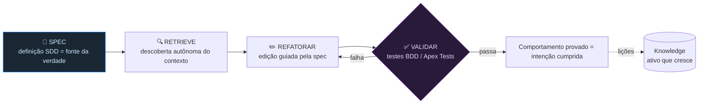
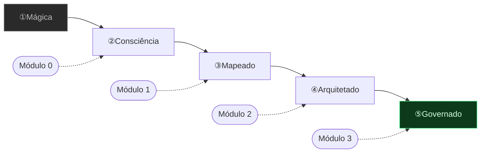

# 04 — Visualizações Interativas e Diagramas Mermaid

> Cobre os **diagramas Mermaid** (instrução explícita de [`site.md`](../../../references/site.md):
> *"use Mermaid.js para os diagramas de fluxo, especialmente o pipeline determinístico"*) e as
> **analogias visuais** (Chef de Cozinha e Freio de F1).
> Cada bloco traz a ficha-padrão e o **código Mermaid pronto para colar**.

> **Nota para o desenvolvedor.** Todo diagrama deve vir acompanhado de seu **equivalente textual**
> (atributo `altText` do componente `MermaidDiagram`, 03 §3). O diagrama é reforço, não pré-requisito.

---

## 1. Módulo 0 — Falha clássica × Crash Silencioso

**Objetivo:** mostrar que a ausência de erro não é ausência de falha.
**Complexidade:** Baixa. **Risco:** o verde "enganoso" pode confundir → legenda explícita.

**Equivalente textual:** uma tarefa entregue à IA segue dois caminhos. Se o código quebra, há erro
visível — barulhento, mas seguro de corrigir. Se não quebra, a demo encanta; aí a pergunta decisiva é
se a *intenção* foi cumprida. Quando não foi e ninguém percebe, ocorre o Crash Silencioso: perda de
valor sem nenhum alerta.

---

## 2. Módulo 1 — Descoberta guiada por jornadas críticas (As-Is)

**Objetivo:** ilustrar a estratégia top-down: partir da jornada de negócio, seguir o call stack e
isolar o código morto. **Complexidade:** Média.

**Equivalente textual:** a descoberta parte de uma jornada crítica de negócio, segue o gatilho pelo
call stack e mapeia todos os componentes que ela toca (classes, flows, integrações), produzindo o
Inventário de Comportamentos (regras core, efeitos colaterais, workarounds). O código que não pertence
a jornada alguma é identificado como morto e isolado.

---

## 3. Módulo 2 — Pipeline determinístico (DAG) · diagrama-chave

**Objetivo:** mostrar que o LLM é chamado *dentro* de uma etapa fixa e nunca decide a próxima — o
oposto do "agente livre". É o diagrama central pedido por `site.md`. **Complexidade:** Média.

**Equivalente textual:** a entrada passa por validação determinística e poda precoce; só o resíduo
interpretativo chega ao LLM, que é invocado dentro de uma etapa fixa. A saída do modelo é validada por
um contrato rígido: se inválida, é rejeitada ou degradada para incerteza; se válida, vira saída
confiável. Um ledger de quota governa o custo da chamada. O LLM nunca decide qual é a próxima etapa.

### 3.1 Cérebro × Vitrine (complementar)

**Equivalente textual:** a Vitrine (interface exposta, leve) e o Cérebro (motor cognitivo pesado com
acesso a dados) são sistemas separados, ligados por um contrato estreito. A Vitrine nunca toca os dados
diretamente.

---

## 4. Módulo 3 — Fluxo Spec-Driven Development

**Objetivo:** mostrar a spec como fonte da verdade e o ciclo Spec → Retrieve → Refatorar → Validar com
loop de feedback. **Complexidade:** Baixa.

**Equivalente textual:** a spec SDD é a fonte da verdade; a partir dela a IA descobre o contexto
(retrieve), refatora guiada pela spec e valida com testes. Se falha, volta a refatorar; se passa, a
intenção está cumprida e as lições alimentam o Knowledge organizacional.

---

## 5. Régua do Modelo de Maturidade (fecho)

**Objetivo:** visualizar a progressão 1→5 e mapear cada módulo ao degrau que ele ataca.
**Complexidade:** Baixa.

---

## 6. Analogias visuais (não-Mermaid)

### 6.1 O Chef de Cozinha (julgamento humano × execução da máquina) — Módulo 3

| Papel | Quem | O que faz |
| :-- | :-- | :-- |
| O cliente | A intenção / o negócio | Define o que precisa ser entregue. |
| O cozinheiro | A IA (ferramenta) | Executa com velocidade e técnica. |
| **O chef executivo** | **Você** | Não cozinha cada prato — **garante que cada prato saia certo**. Julgamento, padrão, contexto. |

- **Ficha:** ilustração em 3 camadas (SVG ou ícones). **Objetivo:** explicar que a maestria é
  julgamento, não digitação. **Complexidade:** Baixa.

### 6.2 O Freio de F1 (restrições aumentam a velocidade segura) — Módulo 2

> Um carro de F1 não anda rápido *apesar* dos freios — anda rápido **por causa** deles. É o freio
> potente que dá ao piloto a coragem de chegar voando na curva. Contratos, determinismo e fail-closed
> são os freios que permitem inovar com IA em alta velocidade sem sair da pista.

- **Ficha:** imagem/ícone + legenda. **Objetivo:** desarmar a objeção "rigor atrasa a inovação".
  **Complexidade:** Baixa.

### 6.3 O Amplificador (clareza × confusão) — Módulo 0

> A IA é um amplificador: mesmo sinal, ganho alto. Clareza organizacional sai amplificada; confusão
> também — só que mais rápido e com cara de competência.

---

## 7. Configuração técnica do Mermaid

- **Lib:** Mermaid.js via CDN (`https://cdnjs.cloudflare.com/ajax/libs/mermaid/...`), `startOnLoad: false`,
  render manual após o conteúdo carregar.
- **Tema:** `theme: 'base'` com `themeVariables` ajustadas ao Dark Tech (fundo `#0d1117`, linhas
  `#30363d`, destaque `#007bff`/`#8a2be2`, texto claro).
- **Acessibilidade:** cada bloco renderiza dentro de `MermaidDiagram` com `altText` (equivalentes
  textuais acima). Em `prefers-reduced-motion`, sem animação de entrada.
- **Fallback:** se o render falhar, exibir o `altText` em destaque (nunca deixar área vazia).

---

### Referências cruzadas

- Onde cada diagrama aparece na narrativa → [02](02_jornada_de_aprendizagem.md)
- Componente `MermaidDiagram` e `AnalogyBlock` → [03](03_wireframes_e_catalogo_de_componentes.md)
- Tokens de cor do tema → [06](06_estilo_roadmap_esforco_riscos.md) §2
